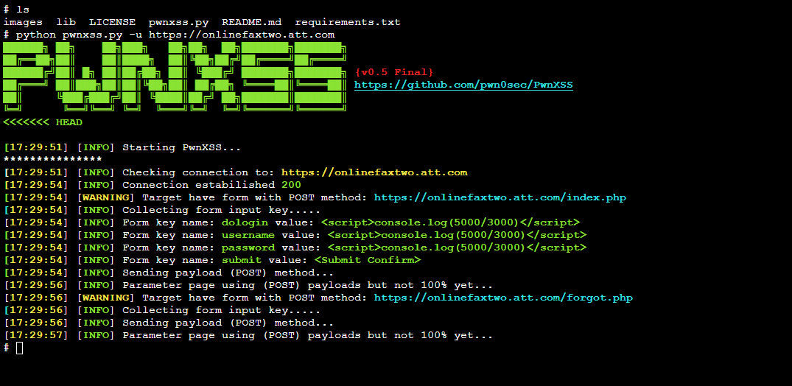

<p align="center">   
 <br/>
A powerful XSS scanner made in python 3.7<br/>


## Installing 

Requirements: <br/>

<li> BeautifulSoup4 </li>

```bash
pip install bs4
```
<li> requests </li> 

```bash
pip install requests
```
<li> python 3.7 </li>
<br/>
Commands:

```bash
git clone https://github.com/pwn0sec/PwnXSS
chmod 755 -R PwnXSS
cd PwnXSS
python3 pwnxss.py --help 
```
## Usage
Basic usage:

```bash
python3 pwnxss.py -u http://testphp.vulnweb.com
```
<br/>
Advanced usage:

```bash
python3 pwnxss.py --help
```

## Main features

* crawling all links on a website ( crawler engine )
* POST and GET forms are supported
* many settings that can be customized
* Advanced error handling
* Multiprocessing support.✔️
* ETC....


## Screenshot



## Roadmap

v0.3B:
------
<li> Added custom options ( --proxy, --user-agent etc... )</li>
<br/>

v0.3B Patch:
------
<li>Added support for ( form method GET ) </li>

v0.4B:
------
<li>Improved Error handling</li>
<li>Now Multiple parameters for GET method is Supported</li>

v0.5 Release (Final):
------
* Bug fixed
* Now cookies is supported. (--cookie {}) 
## Note
* Sorry for my bad english 
* if you run pwnxss on the win10 terminal you will get an untidy output
* now it doesn't support DOM

